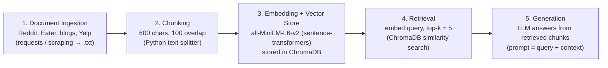

# Project 1 Planning: The Unofficial Guide

> Write this document before you write any pipeline code.
> Your spec and architecture diagram are what you'll use to direct AI tools (Claude, Copilot, etc.) to generate your implementation — the more specific they are, the more useful the generated code will be.
> Update the Retrieval Approach and Chunking Strategy sections if you change your approach during implementation.
> Update this file before starting any stretch features.

---

## Domain

<!-- What domain did you choose? Why is this knowledge valuable and hard to find through official channels? -->

Food and restaurant reviews in the Boston area. This domain provides valuable knowledge for both Boston residents and tourists looking for a good place to eat in the Boston area. It is also hard to find through official channels, since the most useful opinions are scattered across community forums, local blogs, and user reviews rather than collected in one official source.

---

## Documents

<!-- List your specific sources: URLs, subreddit names, forum threads, or file descriptions.
     Aim for at least 10 sources that together cover different subtopics or perspectives within your domain. -->

| # | Source | Description | URL or location |
|---|--------|-------------|-----------------|
| 1 | r/boston | Subreddit threads asking for and sharing restaurant recommendations | https://www.reddit.com/r/boston/ |
| 2 | r/bostonfood | Subreddit focused specifically on Boston-area food and dining | https://www.reddit.com/r/bostonfood/ |
| 3 | Eater Boston | Editorial restaurant guides, reviews, and "best of" lists | https://boston.eater.com/ |
| 4 | The Food Lens | Curated Boston dining guides by category and neighborhood | https://thefoodlens.com/boston/ |
| 5 | Pop.Bop.Shop | Personal blog with 700+ Boston restaurant reviews | https://www.popbopshop.com/ |
| 6 | Confessions of a Chocoholic | Boston-based blog with ongoing restaurant reviews | https://www.confessionsofachocoholic.com/ |
| 7 | Boston Food Truck Blog | Reviews of food trucks across Boston | https://bostonfoodtruckblog.com/ |
| 8 | Boston Magazine — Dining | Magazine restaurant reviews and dining features | https://www.bostonmagazine.com/restaurants/ |
| 9 | Boston.com — Food | Local news outlet food coverage and openings/closings | https://www.boston.com/food/ |
| 10 | Yelp — Boston restaurants | User review text for individual Boston restaurants | https://www.yelp.com/search?find_loc=Boston%2C+MA |

---

## Chunking Strategy

<!-- How will you split documents into chunks?
     State your chunk size (in tokens or characters), overlap size, and explain why those
     numbers fit the structure of your documents.
     A review-heavy corpus warrants different chunking than a long FAQ. -->

**Chunk size:**
600 characters
**Overlap:**
100 characters
**Reasoning:**
Most food reviews are short, so a target chunk size of 600 characters will capture most of a review, often one or two complete reviews including the key details (food, price, service, wait time). To avoid cutting sentences mid-word, the splitter targets 600 characters but extends to the next sentence boundary, up to a hard maximum of about 750 characters; if no boundary is found by then, it cuts at the limit. Reviews longer than this are split into separate chunks while still keeping each chunk's meaning. An overlap of 100 characters ensures a sentence that falls on a chunk boundary still appears intact in an adjacent chunk, making it easier to find and compare chunks.
---

## Retrieval Approach

<!-- Which embedding model are you using (e.g., all-MiniLM-L6-v2 via sentence-transformers)?
     How many chunks will you retrieve per query (top-k)?
     If you were deploying this for real users and cost wasn't a constraint, what tradeoffs
     would you weigh in choosing a different embedding model — context length, multilingual
     support, accuracy on domain-specific text, latency? -->

**Embedding model:**
all-MiniLM-L6-v2 via sentence-transformers.

**Top-k:**
5 chunks.

**Production tradeoff reflection:**
To deploy for real users, I would prefer a model with multilingual support, so that a tourist who does not understand English could ask and get suggestions in their native language. I would also prefer a model with higher accuracy on domain-specific text, such as restaurant slang, dish names, and sentiment in reviews. The tradeoff is that a larger, more capable model usually comes with higher latency and cost per query, which I would accept for the better accuracy and language coverage.
---

## Evaluation Plan

<!-- List your 5 test questions with their expected correct answers.
     Questions should be specific enough that you can judge whether the system's response
     is right or wrong. "What are good dining halls?" is too vague.
     "What do students say about wait times at [dining hall name] during lunch?" is testable. -->

| # | Question | Expected answer |
|---|----------|-----------------|
| 1 | What do reviewers say about the wait time at Mike's Pastry in the North End? | Reviews commonly mention long lines, especially on weekends and evenings, but say the line moves fast; many suggest going on a weekday or trying Modern Pastry nearby to avoid the wait. |
| 2 | Which neighborhood do reviewers recommend for the best ramen in Boston? | Allston is most frequently cited for ramen, with reviewers naming spots like Yume Wo Katare (known for rich tonkotsu and long lines) and Ganko Ittetsu Ramen. |
| 3 | According to reviews, is Neptune Oyster worth the price for its lobster roll? | Most reviewers say yes — the lobster roll (especially the hot buttered version) is praised as among the best in the city, though they note it is expensive and the wait is long since it does not take reservations. |
| 4 | What do reviewers recommend for budget-friendly eats in Chinatown? | Reviewers recommend dim sum and noodle spots such as Gourmet Dumpling House (soup dumplings), Hei La Moon (dim sum), and the bakeries on Beach Street, generally describing them as cheap and filling. |
| 5 | Do reviews recommend any good vegetarian or vegan restaurants in Cambridge? | Yes — reviewers commonly point to Veggie Galaxy in Central Square (vegetarian diner with vegan options) and Life Alive as well-liked vegetarian/vegan spots. |

---

## Anticipated Challenges

<!-- What could go wrong? Name at least two specific risks with reasoning.
     Consider: noisy or inconsistent documents, missing source attribution, off-topic
     retrieval, chunks that split key information across boundaries. -->

1. Missing source attribution. Reviews come from many places (Reddit, blogs, Yelp), so once text is chunked it is easy to lose track of which restaurant or source a chunk came from. If attribution is dropped, the system may give an answer the user cannot trust or verify. Mitigation: store the source name and URL as metadata with each chunk and include it in the generated answer.

2. Inconsistent and noisy documents. Reviews are subjective and disagree with each other — one person loves a place, another hates it — and posts contain slang, typos, emojis, and off-topic chatter. This can lead to contradictory or low-quality retrieved chunks. Mitigation: clean the text during ingestion, retrieve multiple chunks (top-k = 5) so the answer reflects consensus, and prompt the LLM to note when reviews disagree rather than pick one opinion.

3. Off-topic retrieval and split information. Because chunks are a fixed 600 characters, a single review's key points (e.g., food quality and price) can be split across two chunks, and a query may pull chunks that are only loosely related. Mitigation: use 100-character overlap to keep boundary sentences intact and review retrieved chunks against the 5 test questions to confirm they are on-topic.

---

## Architecture

<!-- Draw a diagram of your pipeline showing the five stages:
     Document Ingestion → Chunking → Embedding + Vector Store → Retrieval → Generation
     Label each stage with the tool or library you're using.
     You can use ASCII art, a Mermaid diagram, or embed a sketch as an image.
     You'll use this diagram as context when prompting AI tools to implement each stage. -->

---

## AI Tool Plan

<!-- For each part of the pipeline below, describe:
     - Which AI tool you plan to use (Claude, Copilot, ChatGPT, etc.)
     - What you'll give it as input (which sections of this planning.md, which requirements)
     - What you expect it to produce
     - How you'll verify the output matches your spec

     "I'll use AI to help me code" is not a plan.
     "I'll give Claude my Chunking Strategy section and ask it to implement chunk_text()
     with my specified chunk size and overlap" is a plan. -->

**Milestone 3 — Ingestion and chunking:**
Tool: Claude. Input: my Documents table and Chunking Strategy section. I will ask it to write a script that loads the saved review text files and a `chunk_text()` function that splits them into 600-character chunks with 100-character overlap, breaking near sentence boundaries. Verify: print a few chunks and check the size, overlap, and that sentences are not cut mid-word.

**Milestone 4 — Embedding and retrieval:**
Tool: Claude. Input: my Retrieval Approach section and Architecture diagram. I will ask it to embed the chunks with all-MiniLM-L6-v2 (sentence-transformers), store them in ChromaDB, and write a `retrieve(query, k=5)` function. Verify: run my 5 test questions and check that the returned chunks are relevant to each question.

**Milestone 5 — Generation and interface:**
Tool: Claude. Input: my Evaluation Plan and the `retrieve()` function from Milestone 4. I will ask it to build a simple loop/CLI that takes a question, retrieves the top 5 chunks, and prompts an LLM Groq to answer using only those chunks (with source attribution). Verify: run my 5 test questions and compare the answers to my expected answers.

---

## Stretch Feature — Chunking Strategy Comparison

<!-- Test 2+ chunking approaches on the same query set and report which performed better and why. -->

Goal: test 2+ chunking approaches on the same query set and report which performed better and why.

**Approach:** `chunk_text()` and `build_chunks()` in `src/ingest.py` are parameterized by `target` / `max_size` / `overlap` (the 600 / 750 / 100 spec stays as the defaults). A new script, `src/compare_chunking.py`, builds chunk sets under three strategies — baseline (600/100, sentence-aware), small (300/50), and large (1000/150) — embeds each with all-MiniLM-L6-v2 into its own ChromaDB collection (in a separate `chroma_db_compare/` store so the app's index is untouched), and runs the 5 evaluation questions against each.

**Metric:** retrieval-level and LLM-free, since chunking controls retrieval and excluding generation removes LLM variance. For each question I map the source file(s) that should contain the answer, then measure **hit@5** (did a top-5 chunk come from a correct source?), **MRR** (rank of the first correct-source chunk), and **avg cosine similarity** of retrieved chunks.

**Output:** the script prints a comparison table and writes `chunking_comparison.md`, which names the winning strategy and explains the precision-vs-context trade-off (small chunks are topically sharper but split a review's details; large chunks keep reviews intact but dilute the embedding's relevance signal).

**Run:** `python src/compare_chunking.py` (no Groq key needed).
